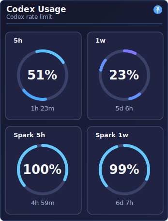
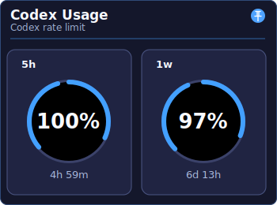

<p align="right"><a href="README.ko.md">🇰🇷 한국어 README</a></p>

# Codex Usage Tray


Codex Usage Tray is a small Windows tray utility for checking Codex usage limits without keeping the Codex app, CLI, or dashboard view open.

It runs locally, starts `codex app-server`, reads Codex rate limit data through stdio JSON-RPC, and shows the result in a compact tray popup.

## Screenshots

| Codex + Spark usage | Codex usage only |
|---|---|
|  |  |

## Features

- Windows system tray utility
- Compact usage popup
- 5-hour and 1-week Codex usage gauges
- Optional Spark usage gauges
- Pinned popup mode
- Global hotkey: `Ctrl+Alt+U`
- Manual refresh and reconnect controls
- Position, time display, shape theme, and color theme settings
- Local settings persistence
- No separate credential required

## How it works

1. The app starts `codex app-server` as a child process.
2. It initializes a stdio JSON-RPC session.
3. It calls `account/rateLimits/read`.
4. It listens for `account/rateLimits/updated` notifications.
5. The tray popup updates when new rate limit data arrives.

The app uses the local Codex runtime session and does not collect telemetry.

## Requirements

- Windows
- Codex CLI / Codex app-server available through the `codex` command
- .NET 10 SDK for local development

Current project target:

```text
net10.0-windows
Windows Forms
```

## Run locally

From the repository root:

```powershell
dotnet run --project app/CodexUsageTray.csproj
```

Or from the app directory:

```powershell
cd app
dotnet run
```

Run the built-in mapper self-test:

```powershell
dotnet run --project app/CodexUsageTray.csproj -- --self-test
```

## Usage

- Left-click the tray icon to open or close the popup.
- Press `Ctrl+Alt+U` to toggle the popup.
- Use the pin button to keep the popup open.
- Right-click the tray icon or popup to open the menu.
- Use `Settings > Usage Rows > GPT-5.3 Spark` to show or hide Spark rows.
- Click the time text to switch between clock time and remaining time.

## Settings

The app stores local settings in `settings.json`.

Example:

```json
{
  "hotkey": "Ctrl+Alt+U",
  "refreshSeconds": 60,
  "warningThresholdPercent": 20,
  "popupGraph": "half-circle",
  "codexCommand": "codex",
  "popupPosition": "BottomRight",
  "shapeTheme": "Bars",
  "colorTheme": "DarkBluePurple",
  "timeDisplayMode": "ClockTime",
  "isPinned": false,
  "showSparkUsage": false
}
```

Notes:

- `timeDisplayMode` can be `ClockTime` or `RemainingTime`.
- `showSparkUsage` enables the Spark rows.
- The `hotkey` setting exists in the settings file, but the current registered hotkey is fixed to `Ctrl+Alt+U`.

## Privacy

Codex Usage Tray is designed as a local utility.

- It launches the local `codex app-server` process.
- It communicates with that process over stdio JSON-RPC.
- It does not include telemetry, analytics, or remote logging.
- It stores settings locally.

## Current limitations

- Windows-only.
- The current UI is Windows Forms.
- The app depends on Codex app-server behavior and available rate limit fields.
- It is a local tray utility, not a cloud dashboard or analytics product.
- Packaging and installer distribution are not finalized yet.

## Roadmap

Near-term:

1. Stabilize the current Windows desktop tray experience.
2. Improve app icon, screenshots, README, and release notes.
3. Add a reproducible Windows build workflow.
4. Prepare a first tagged release.

Next major UI direction:

1. Evaluate or implement a WinUI 3 port.
2. Keep the Codex app-server integration and rate limit mapping behavior stable.
3. Rebuild the UI with a more modern native Windows app structure.
4. Re-evaluate packaging and distribution after the UI direction is settled.

Possible future rename:

- `QuotaScope`

For now, the repository remains `Codex Usage Tray` because the current implementation is Codex-first.

## Documentation

Project notes live under `docs/`.

- `docs/README.md`: operating notes and behavior details
- `docs/PROJECT_MAP.md`: module and file map
- `docs/MODERNIZATION_PLAN.md`: .NET / WinUI modernization plan
- `docs/modules/codex_rate_limits.md`: Codex app-server rate limit schema and mapping notes
